[portfolio](https://abdullahiftikhar.vercel.app) &nbsp;·&nbsp;
[linkedin](https://www.linkedin.com/in/abdullahi-iftikhar/) &nbsp;·&nbsp;
[instagram](https://instagram.com/abdullahiftikhar) &nbsp;·&nbsp;
[email](mailto:ai868419@gmail.com) &nbsp;·&nbsp;
[patreon](https://patreon.com/abdullahiftikhar)

> CS 27 at Information Technology University, Lahore. 
> I build, I compete, and I ship — then I build again.

Full-stack developer and ML enthusiast with 15+ delivered apps for global 
clients, 92% mAP object-detection work at AiBee, and a shelf of competition 
wins: PUCon'25, FCCU CodeFest'25 and LoopVerse'25 & '26 all first, Softec'25 
& '26 runner-up with the AI scheduler Juno and the finance app Karobar.

Teaching assistant for Software Engineering at ITU, IBM-certified DB2 
administrator, and holder of the Microsoft AI & ML Engineering certificate.

<samp>python &nbsp; typescript &nbsp; javascript &nbsp; react &nbsp; next.js &nbsp; node &nbsp; express &nbsp; fastapi &nbsp; flutter &nbsp; dart &nbsp; kotlin &nbsp; java &nbsp; c++ &nbsp; c# &nbsp; unity &nbsp; sql &nbsp; mysql &nbsp; postgres &nbsp; mongodb &nbsp; firebase &nbsp; docker &nbsp; aws &nbsp; gemini &nbsp; opencv &nbsp; git &nbsp; linux</samp>

**Full-Stack Developer** — Freelance &nbsp;·&nbsp; <samp>react, node, flutter, aws</samp> 
15+ web and mobile apps delivered for global clients at a 95% satisfaction 
rate; serverless AWS Lambda backends serving 10,000+ monthly users; legacy 
codebases optimised, database query times cut by half. Since Jan 2025.

**Machine Learning Intern** — AiBee.pk &nbsp;·&nbsp; <samp>yolov8, tensorrt, docker</samp> 
Fine-tuned YOLOv8 and EfficientDet detectors to 92% mAP for retail analytics; 
TensorRT and Docker inference pipelines 40% faster on edge devices; annotated 
5,000+ images and automated data validation, lifting dataset quality by 25%.

**Teaching Assistant** — ITU &nbsp;·&nbsp; <samp>software engineering</samp> 
Teaching assistant for the Software Engineering course at Information 
Technology University, Lahore.

**Karobar** &nbsp;·&nbsp; <samp>flutter, firebase, node</samp> 
SOFTEC'26 runner-up, built in 24 hours: cash-flow tracking, invoicing, 
receipt OCR, forecasting and bulk imports — with a WhatsApp agent for 
inbound commands, outbound alerts, reminders and daily business snapshots.

**[LucidLab AR](https://github.com/abdullahiftikharcode/LucidLab)** &nbsp;·&nbsp; <samp>unity, ar, gemini</samp> 
AR science platform: instructors author experiments in a visual studio, 
students run them on mobile; marker- and plane-based AR with Gemini and 
Vapi voice assistance, and high-fidelity chemistry simulations.

**LoopLab** &nbsp;·&nbsp; <samp>flutter, firebase</samp> 
Student tech-community app, LoopVerse'25 first place: video lectures, live 
sessions, gamification, events and real-time chat with AI-powered support.

**SQL Chat Assistant** &nbsp;·&nbsp; <samp>next.js, fastapi, gemini</samp> 
Natural language to SQL across MySQL, PostgreSQL and SQL Server, with 
schema visualisation, multi-database management and JWT-backed auth.

**GigPanda** &nbsp;·&nbsp; <samp>mern, socket.io</samp> 
MERN freelancing platform: separate client and freelancer dashboards, 
real-time messaging, contracts, proposals and a built-in chatbot.

**CitrusNet** &nbsp;·&nbsp; <samp>python, cnn</samp> 
CNN classifying citrus leaf health — HLB, nutrient deficiency and pest 
damage — with augmentation and a clean evaluation pipeline.

