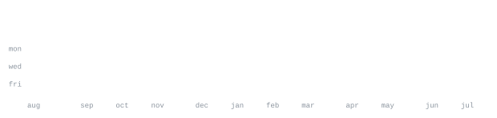

[portfolio](https://abdullahiftikhar.vercel.app) &nbsp;·&nbsp;
[<kbd>resume</kbd>](resume.pdf) &nbsp;·&nbsp;
[linkedin](https://www.linkedin.com/in/abdullahi-iftikhar/) &nbsp;·&nbsp;
[instagram](https://instagram.com/abdullahiftikhar) &nbsp;·&nbsp;
[email](mailto:abdullahiftikharcode@gmail.com) &nbsp;·&nbsp;
[patreon](https://patreon.com/abdullahiftikhar)

> CS 27 at Information Technology University, Lahore, CGPA 3.92/4.00. 
> I build, I compete, and I ship, then I build again.

Agentic AI and full-stack software engineer shipping reliable multi-agent 
systems with trajectory evals, checkpointed memory, and human-in-the-loop 
gates. 6x national hackathon winner: PUCon'25, FCCU CodeFest'25, LoopVerse'25 
and '26 (all 1st), plus Softec'25 and '26 runner-up with Juno and Karobar.

Delivered 15+ web and mobile apps for global clients, optimized edge vision 
models to 92% mAP at AiBee, and served as Teaching Assistant for Software 
Engineering at ITU. IBM-certified DB2 administrator and Microsoft AI & ML 
Engineering Professional certificate holder.

**Languages:** <samp>python &nbsp; typescript &nbsp; javascript &nbsp; go &nbsp; c++ &nbsp; c# &nbsp; c &nbsp; java &nbsp; kotlin &nbsp; dart &nbsp; sql &nbsp; assembly</samp>

**Frameworks:** <samp>react &nbsp; next.js &nbsp; node &nbsp; express &nbsp; fastapi &nbsp; flask &nbsp; django &nbsp; gradio &nbsp; flutter &nbsp; unity &nbsp; ar</samp>

**AI & Agents:** <samp>multi-agent graphs &nbsp; langgraph &nbsp; mcp &nbsp; rag &nbsp; trajectory evals &nbsp; prompt engineering &nbsp; gemini &nbsp; azure openai &nbsp; cohere &nbsp; vapi &nbsp; pytorch &nbsp; yolo &nbsp; opencv</samp>

**Databases:** <samp>postgres &nbsp; mysql &nbsp; mongodb &nbsp; sqlite &nbsp; redis &nbsp; clickhouse &nbsp; qdrant &nbsp; firebase &nbsp; supabase</samp>

**Cloud/DevOps:** <samp>docker &nbsp; kubernetes &nbsp; aws &nbsp; azure &nbsp; gcp &nbsp; vercel &nbsp; terraform &nbsp; github actions &nbsp; ci/cd</samp>

**Tools:** <samp>git &nbsp; rest apis &nbsp; jwt &nbsp; websockets &nbsp; socket.io &nbsp; rabbitmq &nbsp; microservices &nbsp; linux namespaces &nbsp; figma</samp>

**Software Engineer (Agentic Systems & Full-Stack)**, Freelance &nbsp;·&nbsp; <samp>langgraph, mcp, fastapi, next.js</samp> 
Architected stateful multi-agent graphs with checkpointed memory and human-in-the-loop 
gates; exposed client APIs as MCP tool servers for auditable actuation; delivered 
15+ full-stack apps (Next.js, FastAPI, PostgreSQL) at 95%+ client rating. Since Jan 2025.

**Software Engineering Intern**, Powersoft19 &nbsp;·&nbsp; <samp>full-stack, agile</samp> 
Production development across full-stack features: design, code reviews, 
agile sprint delivery, and API integrations. Jun - Aug 2026.

**Machine Learning Intern**, AiBee.pk &nbsp;·&nbsp; <samp>yolov8, tensorrt, docker</samp> 
Fine-tuned YOLOv8 and EfficientDet detectors to 92% mAP for retail analytics; 
built TensorRT and Docker pipelines running 40% faster on edge devices; annotated 
5,000+ images and automated data validation, lifting dataset quality by 25%. Mar 2025 - Jan 2026.

**Teaching Assistant**, ITU &nbsp;·&nbsp; <samp>software engineering</samp> 
Mentored 50+ students in software engineering, Git workflows, and CI/CD 
through labs and code reviews across two academic cohorts. Aug 2025 - Jul 2026.

**Tomoads AdTech Platform** &nbsp;·&nbsp; <samp>fastapi, go, next.js, clickhouse</samp> 
Production ad-network stack: advertiser campaigns, publisher onboarding, 
signed serve tokens, impression/click tracking, wallet-ledger payouts, and 
anti-fraud guardrails with Redis-backed validation.

**Klebbix RAG System** &nbsp;·&nbsp; <samp>fastapi, qdrant, azure openai</samp> 
Production RAG system with hybrid retrieval and reranking, SharePoint sync, 
JWT auth, rate limiting, and multi-format document ingestion with citations.

**Karobar** &nbsp;·&nbsp; <samp>flutter, firebase, node</samp> 
SOFTEC'26 runner-up, built in 24 hours: cash-flow tracking, invoicing, 
receipt OCR, forecasting, and bulk imports, with a WhatsApp agent for 
inbound commands, outbound alerts, reminders, and daily business snapshots.

**Make-It-RAG** &nbsp;·&nbsp; <samp>flask, gemini, react</samp> 
Schema-aware natural language to SQL query agent with tool execution 
and self-correction; presented at the National AI Seminar (NAIS-2025), 
National Centre for Physics, Islamabad. Built with Flask, Gemini, and React.

**[LucidLab AR](https://github.com/abdullahiftikharcode/LucidLab)** &nbsp;·&nbsp; <samp>unity, ar, gemini</samp> 
AR science platform: instructors author experiments in a visual studio, 
students run them on mobile. Marker- and plane-based AR with Gemini and 
Vapi voice assistance, and high-fidelity chemistry simulations.

